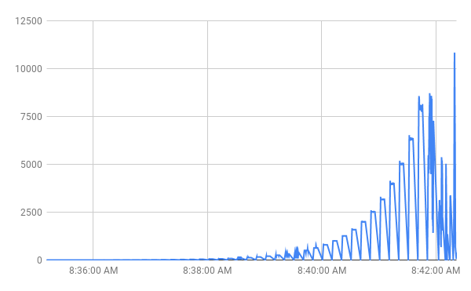
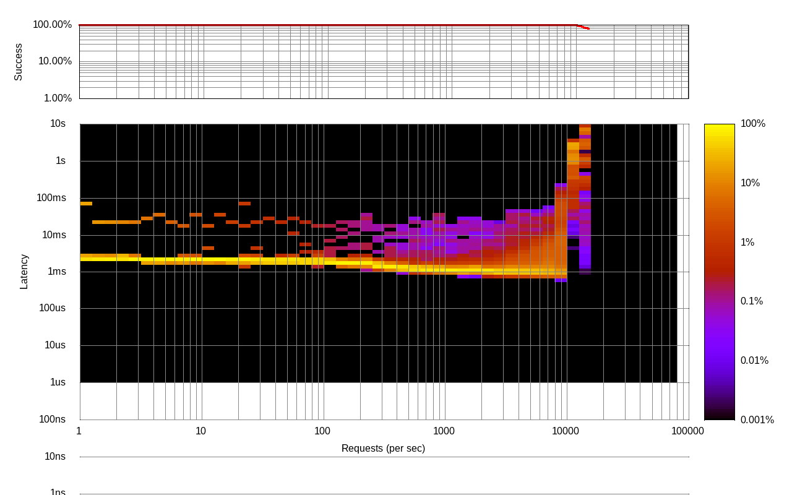
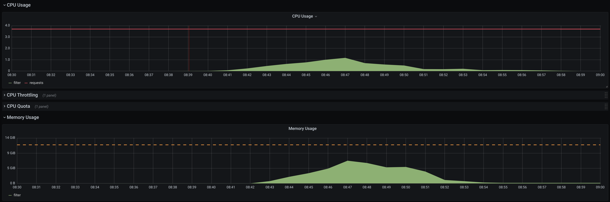
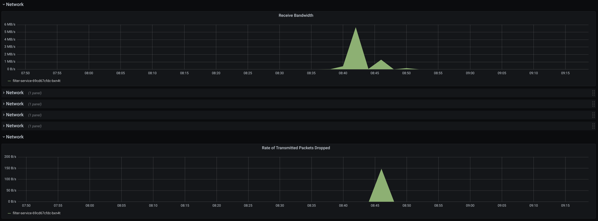
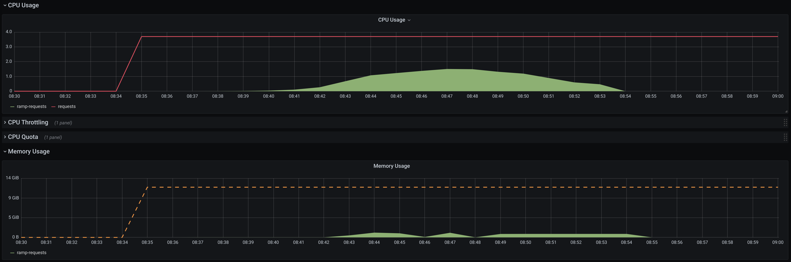
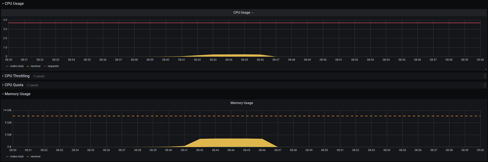

# Triggermesh Routing

Triggermesh Routing repository contains Kubernetes Custom Resources that are
responsible for events routing inside the Triggermesh Bridges. Currently, there
are two components available for routing purposes: Filter and Splitter.

## Triggermesh Content Filter

Triggermesh Content Filter is an addressable Kubernetes object that filters
incoming CloudEvents according to the provided expression. Filter's
Specification consists of only two fields, but they are both required: the
expression and the sink. Events whose content makes the result of the expression
equal to "true" are dispatched to the sink. Filter's expression is a combination
of Google [CEL](https://github.com/google/cel-spec) with the inline types
assertion required by [GJSON](https://github.com/tidwall/gjson). Here is an
example of JSON payload and the expression that access different payload's
paths:

CE data
```json
{
    "id": {
        "first":5,
        "second":3
    },
    "foo": "bar",
    "options": [true, false]
}
```

Possible expression
```
($id.first.(int64) + $id.second.(int64) >= 8) || $foo.(string) == "bar" &&
$options.0.(bool) == true
```

The expression variables are defined as `$.<json path>.(type)`, where "type" can
be any of the following:
- bool
- int64
- uint64
- double (Go's `float64`)
- string


Example of Filter Object:

```yaml
apiVersion: routing.triggermesh.io/v1alpha1
kind: Filter
metadata:
  name: filter-test
spec:
  expression: $id.first.(int64) + $id.second.(int64) == 8
  sink:
    ref:
      apiVersion: serving.knative.dev/v1
      kind: Service
      name: sockeye
```
<i>CloudEvent will be sent to Sockeye service only if event's payload contains
`id.first` and `id.second` paths and the sum of their values is equal to 8.</i>


### Filter Performance

The test environment consisted of three components -
[load ramping](https://github.com/triggermesh/test-infra/tree/main/perf/load-ramping)
tool based on Vegeta, Filter object and CE
[receiver](https://github.com/triggermesh/test-infra/tree/main/perf/thrpt-receiver).
Each of these components were configured to run on dedicated `n1-standard-4`
compute node (4 vCPUs, 15Gb RAM).

The load ramping script was configured to run a succession of attacks at
different rates in periods of 5s, ranging from 1 event/sec to 79,432 events/sec
(theoretical), with a payload of 2 KiB.

Filter expression that was used in the test has three concatenated conditions,
only one of which matches the test
[payload](https://github.com/triggermesh/test-infra/blob/660fda78e08edbf1b3a2034777a69f2f72590cfb/perf/load-ramping/sample-ce-data.json):

```
($id.first.(int64) + $id.second.(int64) >= 8) || $company.(string) == "bar" ||
$0.name.first.(string) == "Jo"
```

Important note regarding Filter resource: the service that actually applies
filtering conditions is multi-tenant, which means that requests to the user's
Filter objects are handled by the pod in the system namespace (`triggermesh` in
our case). This implies that Filter performance described below will be shared
across all Filter users. If we want to get more CE throughput - both vertical
and horizontal scaling can help us achieve this.

#### Results

The receiver service statistics showed that the test environment could normally
sustain the load of around 8 000 events per second:



At the attack rates close to 10 000 events per second, Filter service starts to
receive events delivery timeouts. Vegeta report also shows that the load rate
close to 10 000 events per second is the borderline between the acceptable 100ms
per request and unpredictable 1s+. Further increase in load causes the spikes in
the delivery time up to 10 seconds per request which eventually triggers
Receiver to stop the serving:



Prometheus monitoring data doesn't clearly point to the setup bottleneck: 

<details><summary>Filer pod CPU, Memory, Network usage</summary>
<p>




</p>
</details>

<details><summary>Vegeta pod CPU, Memory usage</summary>
<p>



</p>
</details>


<details><summary>Rceiver pod CPU, Memory usage</summary>
<p>



</p>
</details>


Although these resource usage numbers are a bit higher if they are being
collected in real-time from the system tools (e.g. `top`), there is no obvious
reason that may limit Filter performance. Sometimes Filter pod starts to receive
delivery timeouts and its liveness probe starts to fail, in other cases Receiver
pod is OOMKilled, etc. <i>As far as the current performance fits our
expectations, we can leave deeper digging and possible optimizations for
later.</i>

## Triggermesh Events Splitter

Triggermesh Splitter is a simple Custom Resource that can split arrays inside an
event and produce multiple CloudEvents that will consist of array items.

```
spec:
  path: items
  ceContext:
    type: foo.bar.type
    source: splitter
    extensions:
      key1: value1
      key2: value2
  sink: 
```

Splitter's specification contains following fields:
- path - JSON path in CloudEvent payload where array is expected
- ceContext - CloudEvent context data to override the original event context
- sink - destination to forward resulting events

## Installation

Routing can be compiled and deployed from source with
[ko](https://github.com/google/ko):

```
ko apply -f ./config
```

You can verify that it's installed by checking that the controller is running:

```
$ kubectl -n routing get pods
NAME                                  READY   STATUS    RESTARTS   AGE
filter-service-77b469cf64-5b2hn       1/1     Running   0          4m30s
routing-controller-55bfb7b9b7-l82z6   1/1     Running   0          4m31s
routing-webhook-c8ffc8d88-977f8       1/1     Running   0          4m26s
splitter-service-9f49c7f88-trb9h      1/1     Running   0          4m28s
```

A custom resources of kind `Filter` and `Splitter` can now be created, check
[samples](config/samples) directory.

## Support

We would love your feedback and help on these sources, so don't hesitate to let
us know what is wrong and how we could improve them, just file an
[issue](https://github.com/triggermesh/filter/issues/new) or join those of use
who are maintaining them and submit a
[PR](https://github.com/triggermesh/filter/compare)

## Commercial Support

TriggerMesh Inc supports this project commercially, email info@triggermesh.com
to get more details.

## Code of Conduct

This plugin is by no means part of [CNCF](https://www.cncf.io/) but we abide by
its
[code of conduct](https://github.com/cncf/foundation/blob/master/code-of-conduct.md)

